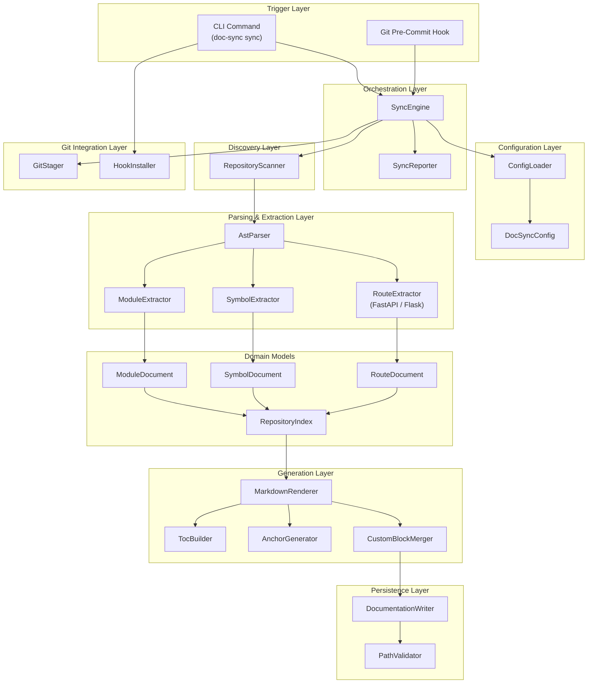
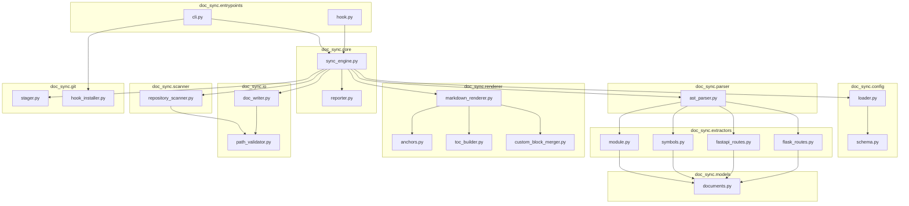
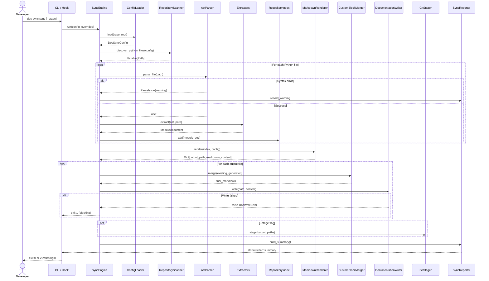
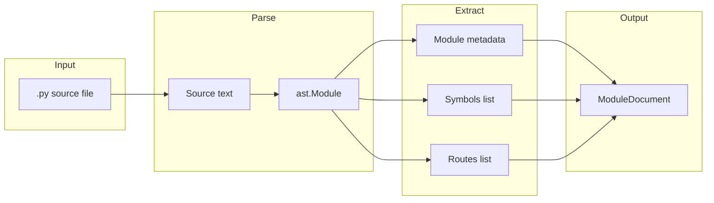
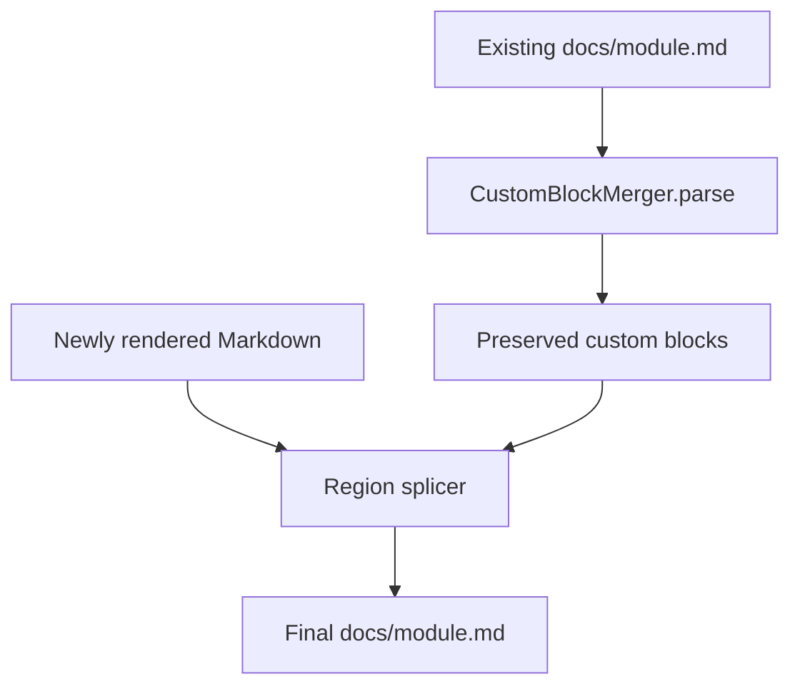
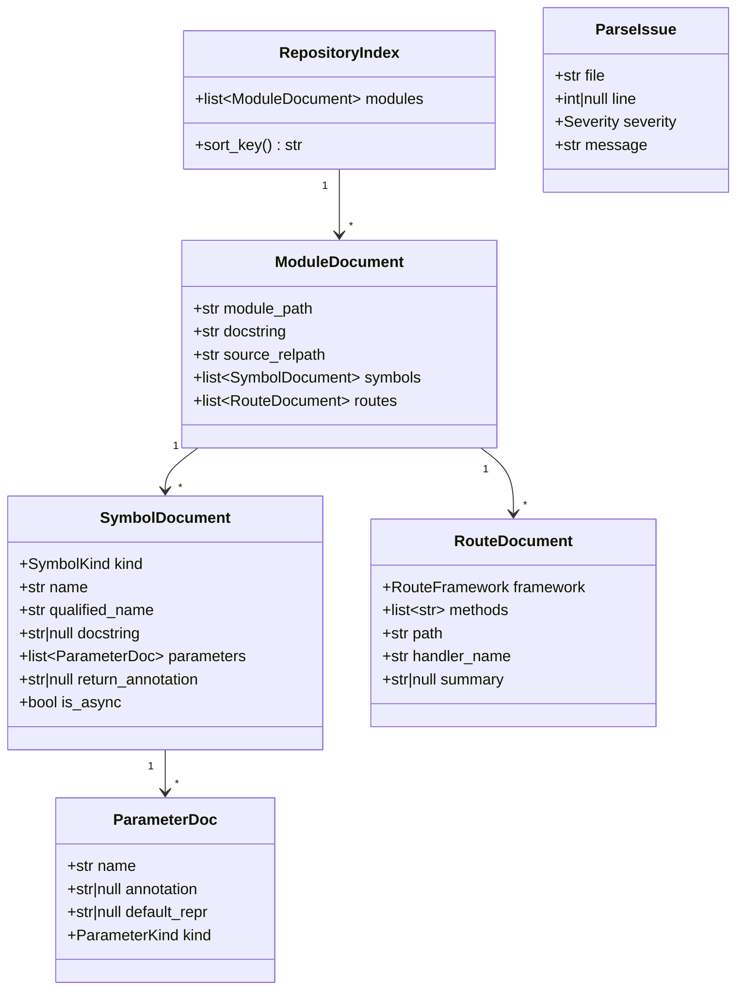
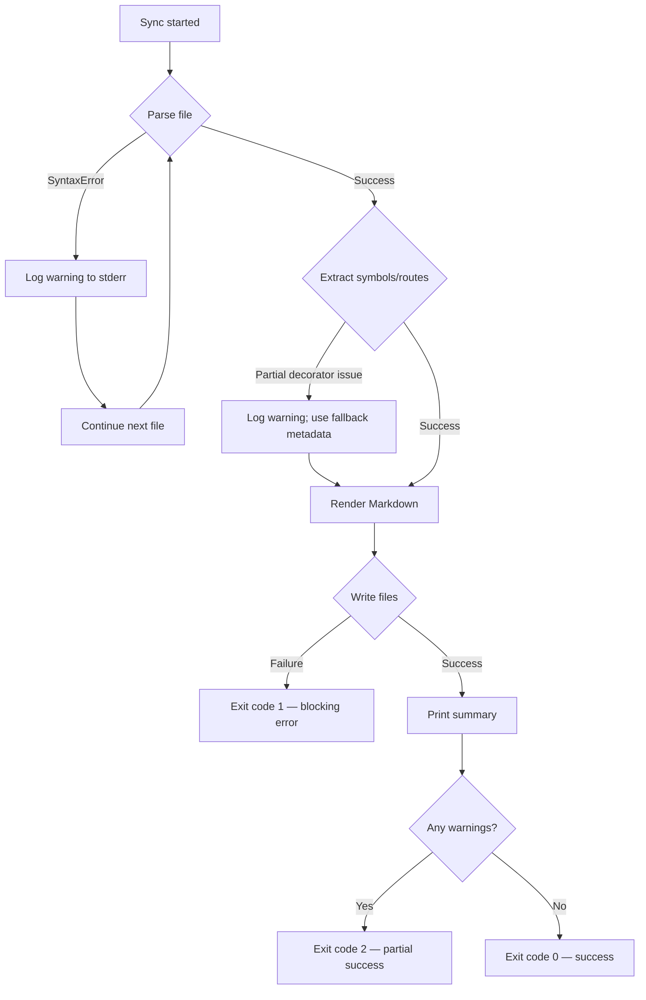

# Automated Documentation Sync — Architecture (v1 MVP)

## Document Information

| Field | Value |
| --- | --- |
| **Product** | Automated Documentation Sync |
| **Version** | 1.0 (MVP) |
| **Status** | Proposed |
| **Requirements Reference** | [requirements.md](./requirements.md) |
| **Last Updated** | 2026-08-14 |

---

## 1. Architecture Overview

Automated Documentation Sync is a **local, offline CLI application** organized as a **layered pipeline**. A single orchestrator (`SyncEngine`) coordinates discovery, AST-based extraction, Markdown rendering, custom-block merging, and optional Git staging. All layers communicate through **immutable in-memory domain models**, keeping parsing, rendering, and I/O concerns isolated.

Design goals aligned with [requirements.md](./requirements.md):

- **Deterministic output** — same input always produces identical Markdown.
- **Partial sync resilience** — per-file failures never abort the entire run unless formatting/writing fails.
- **Safe writes** — output confined to a configured directory; source code is read-only.
- **Extensibility** — route extractors and renderers can grow without rewriting the pipeline.

---

## 2. Technology Stack

| Layer | Choice | Rationale |
| --- | --- | --- |
| **Runtime** | Python 3.10+ | Required by spec; `ast` and type-hint introspection are first-class. |
| **Parsing** | Standard library `ast` | Meets FR-010/NFR-002; no external parser runtime; avoids executing target code (NFR-021). |
| **CLI framework** | [Click](https://click.palletsprojects.com/) | Declarative commands/subcommands, `--help` generation (NFR-030), clean exit-code mapping (NFR-032). |
| **Configuration** | `.doc-sync.yaml` + optional `[tool.doc-sync]` in `pyproject.toml` | Human-readable project config (FR-050); YAML via **PyYAML**; TOML via **stdlib `tomllib`** (3.11+) with **`tomli`** fallback on 3.10. |
| **Path & glob handling** | `pathlib` + `fnmatch` / `pathspec` | Stdlib covers basics; **pathspec** (optional dep) improves `.gitignore`-style exclude rules if needed. |
| **Git integration** | Subprocess calls to `git` CLI | No libgit2 binding required for MVP; staging and hook install only (FR-027). |
| **Testing** | pytest + pytest-cov | Standard Python ecosystem; supports unit and fixture-based integration tests (NFR-041/042). |
| **Packaging** | `pyproject.toml` + setuptools/hatchling | Modern installable package with console script entry point (`doc-sync`). |
| **Logging / warnings** | stdlib `logging` + `warnings` | Structured stderr output for partial sync (FR-040); summary reporter built on top. |

### Explicitly excluded (per requirements)

| Excluded | Reason |
| --- | --- |
| libCST, tree-sitter, parso | FR out-of-scope: native `ast` only |
| Network services / APIs | Fully offline MVP |
| Template engines (Jinja2) | Plain string builders keep output deterministic and dependency-light; may revisit post-MVP |
| OpenAPI generators | Out of scope for v1 |

---

## 3. High-Level Component Diagram



---

## 4. Module Dependency Diagram

Internal Python package layout and dependency direction (top → bottom = allowed imports).



**Dependency rule:** `models` and `config.schema` sit at the bottom of the domain stack; no layer imports from `entrypoints`. Extractors depend on `models` only, not on `renderer` or `io`.

---

## 5. Key Modules & Responsibilities

### 5.1 Entry Points (`doc_sync.entrypoints`)

| Module | Responsibility | Requirements |
| --- | --- | --- |
| `cli.py` | Exposes `doc-sync sync`, `doc-sync install-hook`, global flags (`--repo-root`, `--config`, `--stage`). Maps exit codes. | FR-001, FR-002, FR-027, NFR-030, NFR-032 |
| `hook.py` | Thin wrapper invoked by Git pre-commit; delegates to `SyncEngine`; applies blocking vs non-blocking policy. | FR-003, FR-004, FR-043, FR-044 |

### 5.2 Orchestration (`doc_sync.core`)

| Module | Responsibility | Requirements |
| --- | --- | --- |
| `sync_engine.py` | End-to-end pipeline coordinator: load config → scan → parse/extract → render → merge → write → optional stage. Aggregates per-file errors. | FR-023, NFR-040 |
| `reporter.py` | Emits stderr warnings and final summary (processed/skipped/warned/generated counts). | FR-045, NFR-031 |

### 5.3 Configuration (`doc_sync.config`)

| Module | Responsibility | Requirements |
| --- | --- | --- |
| `loader.py` | Discovers and loads `.doc-sync.yaml` or `[tool.doc-sync]` from `pyproject.toml`; merges CLI overrides. | FR-050 |
| `schema.py` | Validated config dataclass: `repo_root`, `output_dir`, `include`/`exclude` globs, `custom_block_markers`, `stage_on_sync`. | FR-051, FR-052, NFR-011 |

### 5.4 Discovery (`doc_sync.scanner`)

| Module | Responsibility | Requirements |
| --- | --- | --- |
| `repository_scanner.py` | Walks repo tree; yields `.py` file paths matching include/exclude rules; skips `venv`, `.git`, `__pycache__`. | FR-011 |

### 5.5 Parsing & Extraction (`doc_sync.parser`, `doc_sync.extractors`)

| Module | Responsibility | Requirements |
| --- | --- | --- |
| `ast_parser.py` | Reads source, runs `ast.parse()`, catches `SyntaxError`, returns `ParseResult` (tree or error). Never executes module code. | FR-010, FR-040, NFR-021 |
| `module.py` | Extracts module docstring and qualified module name. | FR-012, FR-018 |
| `symbols.py` | Extracts classes, methods, functions; captures docstrings, signatures, type hints; builds placeholders when docstrings absent. | FR-013, FR-014, FR-017 |
| `fastapi_routes.py` | Detects `@app.get/post/...`, `@router.*` decorators; extracts HTTP method, path, handler, decorator kwargs (`summary`, `description`). | FR-015 |
| `flask_routes.py` | Detects `@app.route`, `@blueprint.route`; extracts methods, rule, endpoint; falls back to handler docstring. | FR-016, FR-041 |

### 5.6 Domain Models (`doc_sync.models`)

| Model | Fields (conceptual) | Purpose |
| --- | --- | --- |
| `ParameterDoc` | name, annotation, default, kind | Render signatures |
| `SymbolDocument` | kind, name, qualified_name, docstring, parameters, returns, is_async, decorators | Classes, functions, methods |
| `RouteDocument` | framework, methods, path, handler_name, summary | API route tables |
| `ModuleDocument` | module_path, docstring, symbols, routes, source_relpath | One page of output |
| `RepositoryIndex` | ordered list of `ModuleDocument`, metadata for TOC | Feeds `API.md` and module pages |
| `ParseIssue` | file, line, severity, message | Partial sync reporting |

All models are **immutable dataclasses** (or frozen Pydantic models if validation complexity grows), sorted deterministically before render.

### 5.7 Generation (`doc_sync.renderer`)

| Module | Responsibility | Requirements |
| --- | --- | --- |
| `anchors.py` | Generates GitHub-compatible slugs from qualified names (`myapp.services.user.UserService.create_user` → stable heading id). | FR-024, NFR-051 |
| `markdown_renderer.py` | Renders module pages and `API.md` from `RepositoryIndex`; wraps auto-generated regions in sentinel comments. | FR-020–FR-022, FR-026 |
| `toc_builder.py` | Builds nested Table of Contents with links to module files and in-page anchors. | FR-021 |
| `custom_block_merger.py` | Parses existing Markdown for `<!-- custom:start -->` … `<!-- custom:end -->`; splices preserved blocks into newly rendered output. | FR-025, FR-030–FR-032 |

**Auto-generated region convention:**

```markdown
<!-- doc-sync:begin module:myapp.services.user -->
... generated content ...
<!-- doc-sync:end module:myapp.services.user -->
```

Only content between `doc-sync:begin/end` is overwritten; custom marker blocks remain untouched.

### 5.8 Persistence (`doc_sync.io`)

| Module | Responsibility | Requirements |
| --- | --- | --- |
| `path_validator.py` | Resolves paths relative to repo root; rejects traversal (`../` escapes); ensures writes stay under `output_dir`. | NFR-011, NFR-022 |
| `doc_writer.py` | Atomic write (temp file + rename) of Markdown files; creates directories as needed; raises on formatting/I/O failure. | FR-042, FR-044, NFR-013 |

### 5.9 Git Integration (`doc_sync.git`)

| Module | Responsibility | Requirements |
| --- | --- | --- |
| `hook_installer.py` | Writes executable pre-commit script to `.git/hooks/pre-commit` or integrates via pre-commit framework entry. | FR-003 |
| `stager.py` | Runs `git add` on changed files under `docs/` when `--stage` enabled. | FR-027 |

---

## 6. Data Flow

### 6.1 End-to-End Sync Sequence



### 6.2 Per-File Extraction Data Flow



### 6.3 Markdown Merge Data Flow



**Merge algorithm (deterministic):**

1. Read existing file (if any); extract all custom-marker regions keyed by marker id/position.
2. Generate fresh auto-content for each module/API section with `doc-sync:begin/end` sentinels.
3. Insert preserved custom blocks at their original relative positions (top of file, after module header, etc.) based on marker metadata.
4. Write atomically to output path.

---

## 7. Data Model Schema (Conceptual)



---

## 8. Output Layout

```
docs/
├── API.md                      # Top-level TOC + cross-module API summary
└── modules/
    ├── myapp.md                # Package-level overview (optional grouping)
    ├── myapp.services.user.md  # One file per module (configurable)
    └── ...
```

| File | Contents |
| --- | --- |
| `docs/API.md` | Project-level TOC, route summary tables, links to module pages with anchors |
| `docs/modules/<qualified-name>.md` | Module docstring, classes, functions, route tables, stable `{#anchor}` headings |

---

## 9. Error Handling Strategy



| Failure type | Behavior | Hook impact | Exit code |
| --- | --- | --- | --- |
| Python syntax error in source | Skip file; warn | Non-blocking | Contributes to `2` |
| Missing docstring | Placeholder entry | Non-blocking | — |
| Route decorator parse failure | Warn; fallback metadata | Non-blocking | Contributes to `2` |
| Markdown render error | Fail run | **Blocking** | `1` |
| File write / path validation error | Fail run | **Blocking** | `1` |
| Success with prior warnings | Complete | Allow commit | `2` |
| Clean success | Complete | Allow commit | `0` |

---

## 10. Security & Safety Controls

| Control | Implementation |
| --- | --- |
| **No code execution** | `ast.parse()` only; never `importlib.import_module()` on target sources |
| **Path confinement** | `PathValidator` resolves canonical paths; write targets must be under `{repo_root}/{output_dir}` |
| **No secrets** | Tool is fully offline; no env vars required beyond optional `GIT_DIR` |
| **Atomic writes** | Prevents partial/corrupt Markdown on crash mid-write |
| **Read-only source** | Scanner and parser open source files in read mode only |

---

## 11. Extension Points (Post-MVP)

| Extension | Seam |
| --- | --- |
| New web framework routes | Add extractor implementing `RouteExtractor` protocol |
| New output format (OpenAPI) | Add renderer implementing `OutputRenderer` protocol |
| CI integration | New entry point wrapping `SyncEngine` |
| Additional languages | Parallel parser/extractor pipeline behind `LanguagePlugin` interface |

For MVP, **protocols are informal** (duck-typed modules) to avoid over-engineering; refactor to explicit `typing.Protocol` when second implementations land.

---

## 12. Project Structure (Proposed)

```
automated-doc-sync/
├── pyproject.toml
├── requirements.md
├── architecture.md
├── src/
│   └── doc_sync/
│       ├── __init__.py
│       ├── entrypoints/
│       │   ├── cli.py
│       │   └── hook.py
│       ├── core/
│       │   ├── sync_engine.py
│       │   └── reporter.py
│       ├── config/
│       │   ├── loader.py
│       │   └── schema.py
│       ├── scanner/
│       │   └── repository_scanner.py
│       ├── parser/
│       │   └── ast_parser.py
│       ├── extractors/
│       │   ├── module.py
│       │   ├── symbols.py
│       │   ├── fastapi_routes.py
│       │   └── flask_routes.py
│       ├── models/
│       │   └── documents.py
│       ├── renderer/
│       │   ├── anchors.py
│       │   ├── markdown_renderer.py
│       │   ├── toc_builder.py
│       │   └── custom_block_merger.py
│       ├── io/
│       │   ├── doc_writer.py
│       │   └── path_validator.py
│       └── git/
│           ├── stager.py
│           └── hook_installer.py
└── tests/
    ├── unit/
    ├── integration/
    └── fixtures/
        ├── sample_fastapi_project/
        └── sample_flask_project/
```

---

## 13. Requirements Traceability Matrix

| Requirement IDs | Architecture component |
| --- | --- |
| FR-001 – FR-004 | `entrypoints/cli.py`, `entrypoints/hook.py` |
| FR-010 – FR-018 | `parser/`, `extractors/`, `models/` |
| FR-020 – FR-027 | `renderer/`, `io/`, `git/stager.py` |
| FR-030 – FR-032 | `renderer/custom_block_merger.py` |
| FR-040 – FR-045 | `core/sync_engine.py`, `core/reporter.py` |
| FR-050 – FR-052 | `config/` |
| NFR-001 – NFR-013 | Pipeline design, atomic writes, deterministic sort |
| NFR-020 – NFR-022 | Security controls (§10) |
| NFR-040 – NFR-042 | Module boundaries, `tests/` layout |

---

## 14. Open Decisions

| Topic | Proposal | Status |
| --- | --- | --- |
| One Markdown file per module vs per package | **Per module** default; configurable grouping in v1.1 | Proposed |
| Hook delivery | Native `.git/hooks/pre-commit` script for MVP | Proposed |
| `pathspec` dependency | Include if exclude rules need gitignore semantics; otherwise stdlib globs | Proposed |
| Anchor slug algorithm | GitHub-style: lowercase, hyphenated, deduplicated | Proposed |

---

## 15. Summary

The v1 architecture is a **single-process, layered pipeline** triggered by CLI or Git hook. Python's `ast` module feeds immutable domain models; a Markdown renderer and custom-block merger produce deterministic docs under `docs/`; optional Git staging completes the workflow. The design satisfies all MVP functional and non-functional requirements while keeping extension seams clear for multi-language and OpenAPI support later.
