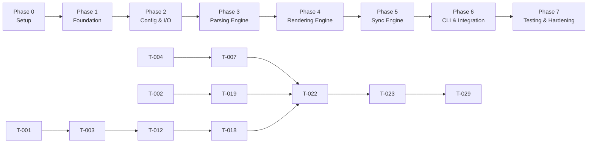

# Automated Documentation Sync — Implementation Plan (v1 MVP)

## Document Information

| Field | Value |
| --- | --- |
| **Product** | Automated Documentation Sync |
| **Version** | 1.0 (MVP) |
| **Status** | Approved for execution |
| **References** | [requirements.md](./requirements.md), [architecture.md](./architecture.md), [design-review.md](./design-review.md) |
| **Last Updated** | 2026-08-18 |

---

## 1. Overview

This plan breaks the MVP into **6 phases** and **32 tasks**, ordered by dependency. Each task includes:

- **Task ID** — unique reference for tracking
- **Dependencies** — tasks that must complete first (`—` if none)
- **Complexity** — `S` (small, ≤1 day), `M` (medium, 1–2 days), `L` (large, 2–3 days)
- **Blocked** — whether the task cannot start until dependencies are done
- **Acceptance Criteria** — testable definition of done
- **Requirements / Decisions** — traceability

### Complexity Legend

| Symbol | Effort | Typical scope |
| --- | --- | --- |
| **S** | ≤ 1 day | Single module, ≤ 5 unit tests |
| **M** | 1–2 days | Module + integration touchpoints, 5–15 tests |
| **L** | 2–3 days | Multi-module feature, fixture project, 15+ tests |

### Dependency Graph (Critical Path)



**Critical path:** T-001 → T-003 → T-004 → T-007 → T-011 → T-013 → T-018 → T-019 → T-022 → T-023 → T-029

---

## 2. Phase 0 — Project Setup

> **Goal:** Bootstrapped, installable Python package with CI scaffolding.  
> **Exit criteria:** `pip install -e .` succeeds; `doc-sync --help` runs (stub).

---

### T-001 — Initialize project structure and packaging

| Field | Value |
| --- | --- |
| **Dependencies** | — |
| **Complexity** | S |
| **Blocked** | No |
| **Requirements** | NFR-040, NFR-050 |

**Tasks:**

- [ ] Create `pyproject.toml` with hatchling/setuptools, Python 3.10+ constraint
- [ ] Define package layout under `src/doc_sync/` per [architecture.md §12](./architecture.md)
- [ ] Register console script entry point: `doc-sync = doc_sync.entrypoints.cli:main`
- [ ] Pin runtime deps: `click`, `pyyaml`, `pathspec`; dev deps: `pytest`, `pytest-cov`
- [ ] Add conditional `tomli` dep for Python 3.10 (`tomllib` stdlib on 3.11+)
- [ ] Create empty `__init__.py` files for all subpackages
- [ ] Add `.gitignore` (venv, `__pycache__`, `.doc-sync.lock`, `dist/`, `.coverage`)

**Acceptance Criteria:**

- `pip install -e ".[dev]"` completes without error
- `doc-sync --help` prints stub help text
- All subpackage directories exist matching architecture layout

---

### T-002 — Define exception hierarchy and shared types

| Field | Value |
| --- | --- |
| **Dependencies** | T-001 |
| **Complexity** | S |
| **Blocked** | No (parallel with T-003 after T-001) |
| **Requirements** | FR-042, DD-04 |
| **Decisions** | DD-04 |

**Tasks:**

- [ ] Create `doc_sync/exceptions.py` with:
  - `DocSyncError` (base)
  - `ConfigError`, `PathValidationError`
  - `DocMergeError` (blocking)
  - `DocWriteError` (blocking)
  - `RunLockError` (blocking)
- [ ] Define `Severity` enum: `WARNING`, `ERROR`
- [ ] Define exit code constants: `EXIT_SUCCESS=0`, `EXIT_FAILURE=1`, `EXIT_PARTIAL=2`

**Acceptance Criteria:**

- All exception classes inherit from `DocSyncError`
- Exit codes match [architecture.md §9](./architecture.md)
- Unit test verifies exception hierarchy and exit code values

---

## 3. Phase 1 — Foundation (Domain Models)

> **Goal:** Immutable data models used by all layers.  
> **Exit criteria:** Models instantiate, serialize consistently, sort deterministically.

---

### T-003 — Implement domain models

| Field | Value |
| --- | --- |
| **Dependencies** | T-001 |
| **Complexity** | M |
| **Blocked** | No |
| **Requirements** | FR-012 – FR-018, NFR-012 |

**Tasks:**

- [ ] Implement frozen dataclasses in `doc_sync/models/documents.py`:
  - `ParameterDoc`, `SymbolDocument`, `RouteDocument`, `ModuleDocument`, `RepositoryIndex`, `ParseIssue`
- [ ] Define enums: `SymbolKind`, `RouteFramework`, `ParameterKind`
- [ ] Implement deterministic `sort_key()` on `RepositoryIndex` and nested collections
- [ ] Add factory/helper for placeholder `SymbolDocument` when docstring is absent (FR-017)

**Acceptance Criteria:**

- All models are immutable (`frozen=True`)
- Two identical inputs produce identical `RepositoryIndex.sort_key()` output
- Placeholder symbols include name, parameters, and return annotation fields
- Unit tests cover creation, sorting, and placeholder generation

---

## 4. Phase 2 — Configuration & I/O Layer

> **Goal:** Safe config loading and filesystem guardrails.  
> **Exit criteria:** Config loads from YAML/TOML; paths validated; atomic writes work.

---

### T-004 — Implement configuration schema

| Field | Value |
| --- | --- |
| **Dependencies** | T-001 |
| **Complexity** | S |
| **Blocked** | No |
| **Requirements** | FR-050 – FR-052 |
| **Decisions** | DD-02, DD-05, DD-10, DD-12 |

**Tasks:**

- [ ] Implement `DocSyncConfig` frozen dataclass in `doc_sync/config/schema.py`
- [ ] Fields: `repo_root`, `output_dir`, `include`, `exclude`, `custom_block_markers`, `stage_on_sync`, `prune_orphans`, `include_private`, `max_source_bytes`
- [ ] Provide sensible defaults (`output_dir="docs"`, `prune_orphans=True`, `include_private=False`, `max_source_bytes=1_048_576`)

**Acceptance Criteria:**

- Default config matches architecture spec
- All fields have documented types and defaults
- Unit test instantiates config with defaults and custom values

---

### T-005 — Implement configuration loader

| Field | Value |
| --- | --- |
| **Dependencies** | T-004 |
| **Complexity** | M |
| **Blocked** | Yes — blocked by **T-004** |
| **Requirements** | FR-050 |
| **Decisions** | DD-02 |

**Tasks:**

- [ ] Implement `ConfigLoader` in `doc_sync/config/loader.py`
- [ ] Load `.doc-sync.yaml` using **`yaml.safe_load` only** (never `yaml.load`)
- [ ] Load `[tool.doc-sync]` from `pyproject.toml` via `tomllib` / `tomli`
- [ ] Merge precedence: defaults < file config < CLI overrides
- [ ] Reject unknown config keys with descriptive `ConfigError`

**Acceptance Criteria:**

- YAML file with `!!python/object` tag raises `ConfigError`
- Both YAML and TOML config sources load correctly
- Unknown keys rejected with key name in error message
- Unit tests cover YAML, TOML, merge order, and rejection paths

---

### T-006 — Implement configuration validator

| Field | Value |
| --- | --- |
| **Dependencies** | T-004, T-005 |
| **Complexity** | S |
| **Blocked** | Yes — blocked by **T-004**, **T-005** |
| **Requirements** | NFR-011 |
| **Decisions** | DD-02, DD-10 |

**Tasks:**

- [ ] Implement `validate_config()` in `doc_sync/config/validator.py`
- [ ] Enforce `output_dir` is relative (no absolute paths)
- [ ] Validate `max_source_bytes > 0`
- [ ] Validate include/exclude are non-empty lists of strings
- [ ] Normalize `repo_root` to absolute path

**Acceptance Criteria:**

- Absolute `output_dir` raises `ConfigError`
- `max_source_bytes=0` raises `ConfigError`
- `repo_root` stored as resolved absolute path
- Unit tests cover all validation rules

---

### T-007 — Implement path validator (security sandbox)

| Field | Value |
| --- | --- |
| **Dependencies** | T-004, T-006 |
| **Complexity** | M |
| **Blocked** | Yes — blocked by **T-004**, **T-006** |
| **Requirements** | NFR-011, NFR-022 |
| **Decisions** | DD-01, DD-13 |

**Tasks:**

- [ ] Implement `PathValidator` in `doc_sync/io/path_validator.py`
- [ ] Resolve write paths under `{repo_root}/{output_dir}` strictly
- [ ] Reject path traversal (`../` escapes)
- [ ] Reject symlink write targets
- [ ] Hash module paths > 200 chars: `modules/<hash>__<truncated>.md`
- [ ] Expose `resolve_output_path(module_path) -> Path` and `validate_write_path(path) -> Path`

**Acceptance Criteria:**

- Attempt to write outside sandbox raises `PathValidationError`
- Symlink in output path rejected
- Long module name produces deterministic hashed filename
- Unit tests cover traversal, symlink, and long-path cases on POSIX (and Windows where available)

---

### T-008 — Implement run lock

| Field | Value |
| --- | --- |
| **Dependencies** | T-007 |
| **Complexity** | S |
| **Blocked** | Yes — blocked by **T-007** |
| **Requirements** | NFR-013 |
| **Decisions** | DD-09 |

**Tasks:**

- [ ] Implement `RunLock` context manager in `doc_sync/io/run_lock.py`
- [ ] Create exclusive lock file `.doc-sync.lock` in output directory
- [ ] Stale TTL: 5 minutes — auto-release if lock is older
- [ ] Raise `RunLockError` if active lock held by another process

**Acceptance Criteria:**

- Second concurrent acquire raises `RunLockError`
- Stale lock (> 5 min) is replaced automatically
- Lock released on context exit even on exception
- Unit test simulates concurrent acquire and stale lock recovery

---

### T-009 — Implement documentation writer

| Field | Value |
| --- | --- |
| **Dependencies** | T-007 |
| **Complexity** | S |
| **Blocked** | Yes — blocked by **T-007** |
| **Requirements** | FR-020, FR-042, NFR-013 |
| **Decisions** | DD-01 |

**Tasks:**

- [ ] Implement `DocumentationWriter` in `doc_sync/io/doc_writer.py`
- [ ] Atomic write: temp file in same directory + `os.replace()`
- [ ] Create parent directories as needed
- [ ] Raise `DocWriteError` with file path on I/O failure
- [ ] Never write outside validated paths (delegate to `PathValidator`)

**Acceptance Criteria:**

- Crash mid-write leaves original file intact
- Write to invalid path raises `DocWriteError`
- Unit tests verify atomic behavior and directory creation

---

### T-010 — Implement repository scanner

| Field | Value |
| --- | --- |
| **Dependencies** | T-004, T-007 |
| **Complexity** | M |
| **Blocked** | Yes — blocked by **T-004**, **T-007** |
| **Requirements** | FR-011 |
| **Decisions** | DD-01, DD-14 |

**Tasks:**

- [ ] Implement `RepositoryScanner` in `doc_sync/scanner/repository_scanner.py`
- [ ] Use **pathspec** for gitignore-compatible include/exclude matching
- [ ] Default excludes: `.git/`, `venv/`, `.venv/`, `__pycache__/`, `*.egg-info/`
- [ ] Do not follow symlinks during walk
- [ ] Yield sorted, deterministic list of `.py` paths

**Acceptance Criteria:**

- Files in `venv/` and `.git/` are excluded by default
- Include pattern limits scan to specified packages (FR-051)
- Output order is deterministic across runs
- Unit tests with temp directory fixture cover include/exclude/symlink-skip

---

## 5. Phase 3 — Parsing Engine

> **Goal:** AST-based extraction of docstrings, symbols, type hints, and routes.  
> **Exit criteria:** Sample `.py` files produce populated `ModuleDocument` instances.

---

### T-011 — Implement AST parser

| Field | Value |
| --- | --- |
| **Dependencies** | T-003, T-004 |
| **Complexity** | M |
| **Blocked** | Yes — blocked by **T-003**, **T-004** |
| **Requirements** | FR-010, FR-040, NFR-021 |
| **Decisions** | DD-10 |

**Tasks:**

- [ ] Implement `AstParser` in `doc_sync/parser/ast_parser.py`
- [ ] Read source UTF-8 strict; fallback via `tokenize.detect_encoding`
- [ ] Enforce `max_source_bytes`; skip oversized files with `ParseIssue` warning
- [ ] Run `ast.parse()`; catch `SyntaxError` → return `ParseResult(error=...)`
- [ ] Never import or execute target module code
- [ ] Discard AST after extraction (no retention)

**Acceptance Criteria:**

- Valid Python file returns `ast.Module`
- Syntax error returns `ParseIssue` with file path and line number
- File > `max_source_bytes` skipped with warning
- Non-UTF-8 file handled via encoding detection or skipped with warning
- Unit tests cover happy path, syntax error, oversized, and encoding edge cases

---

### T-012 — Implement module extractor

| Field | Value |
| --- | --- |
| **Dependencies** | T-003, T-011 |
| **Complexity** | S |
| **Blocked** | Yes — blocked by **T-003**, **T-011** |
| **Requirements** | FR-012, FR-018 |

**Tasks:**

- [ ] Implement `ModuleExtractor` in `doc_sync/extractors/module.py`
- [ ] Extract module-level docstring from AST
- [ ] Derive qualified module path from file path relative to repo root
- [ ] Support namespace packages (no `__init__.py`)

**Acceptance Criteria:**

- Module docstring extracted when present
- Module path matches file location (e.g., `myapp/services/user.py` → `myapp.services.user`)
- Namespace package file without `__init__.py` handled correctly
- Unit tests with fixture AST nodes

---

### T-013 — Implement symbol extractor

| Field | Value |
| --- | --- |
| **Dependencies** | T-003, T-011 |
| **Complexity** | L |
| **Blocked** | Yes — blocked by **T-003**, **T-011** |
| **Requirements** | FR-013, FR-014, FR-017 |
| **Decisions** | DD-12 |

**Tasks:**

- [ ] Implement `SymbolExtractor` in `doc_sync/extractors/symbols.py`
- [ ] Extract classes with methods, top-level functions, nested functions
- [ ] Capture docstrings, parameters, return annotations via `ast.unparse()`
- [ ] Handle `@property`, `@classmethod`, `@staticmethod` with decorator badges
- [ ] Skip private symbols (`_prefix`) unless `include_private=True`
- [ ] Generate placeholder entry when docstring missing (FR-017)
- [ ] Support `from __future__ import annotations`

**Acceptance Criteria:**

- Classes, methods, and functions appear in `SymbolDocument` list
- Type hints rendered as strings via `ast.unparse()`
- Missing docstring produces placeholder with signature
- Private symbols excluded by default
- Unit tests cover classes, async functions, decorators, private filter, placeholders

---

### T-014 — Implement FastAPI route extractor

| Field | Value |
| --- | --- |
| **Dependencies** | T-003, T-011 |
| **Complexity** | M |
| **Blocked** | Yes — blocked by **T-003**, **T-011** |
| **Requirements** | FR-015, FR-041 |
| **Decisions** | DD-11 |

**Tasks:**

- [ ] Implement `FastAPIRouteExtractor` in `doc_sync/extractors/fastapi_routes.py`
- [ ] Detect `@app.get/post/put/patch/delete/head/options` and `@router.*` decorators
- [ ] Extract HTTP method, **literal** path, handler name, `summary`/`description` kwargs
- [ ] Non-literal paths → path `"<dynamic>"` + warning

**Acceptance Criteria:**

- `@app.get("/users")` produces `RouteDocument(methods=["GET"], path="/users")`
- Variable/f-string path produces `"<dynamic>"` and logs warning
- Decorator parse failure falls back to handler metadata with warning (FR-041)
- Unit tests with AST fixtures for literal and dynamic paths

---

### T-015 — Implement Flask route extractor

| Field | Value |
| --- | --- |
| **Dependencies** | T-003, T-011 |
| **Complexity** | M |
| **Blocked** | Yes — blocked by **T-003**, **T-011** |
| **Requirements** | FR-016, FR-041 |
| **Decisions** | DD-11 |

**Tasks:**

- [ ] Implement `FlaskRouteExtractor` in `doc_sync/extractors/flask_routes.py`
- [ ] Detect `@app.route`, `@blueprint.route` decorators
- [ ] Extract HTTP methods, **literal** rule, endpoint name
- [ ] Fall back to handler docstring for description
- [ ] Non-literal rules → `"<dynamic>"` + warning

**Acceptance Criteria:**

- `@app.route("/items", methods=["GET", "POST"])` produces correct `RouteDocument`
- Dynamic rule string produces `"<dynamic>"` with warning
- Unit tests mirror FastAPI extractor coverage

---

### T-016 — Implement extraction orchestrator helper

| Field | Value |
| --- | --- |
| **Dependencies** | T-012, T-013, T-014, T-015 |
| **Complexity** | S |
| **Blocked** | Yes — blocked by **T-012**, **T-013**, **T-014**, **T-015** |
| **Requirements** | FR-018 |

**Tasks:**

- [ ] Create `doc_sync/extractors/__init__.py` with `extract_module(ast, path, config) -> ModuleDocument`
- [ ] Compose module, symbol, and route extractors into single `ModuleDocument`
- [ ] Aggregate warnings from sub-extractors into `ParseIssue` list

**Acceptance Criteria:**

- Single call returns fully populated `ModuleDocument`
- Warnings from route extractors propagate to caller
- Integration test parses a sample file end-to-end through all extractors

---

## 6. Phase 4 — Rendering Engine

> **Goal:** Deterministic Markdown generation with TOC, anchors, and custom-block merge.  
> **Exit criteria:** `RepositoryIndex` renders to valid Markdown files.

---

### T-017 — Implement anchor generator

| Field | Value |
| --- | --- |
| **Dependencies** | T-003 |
| **Complexity** | S |
| **Blocked** | No (after T-003) |
| **Requirements** | FR-024, NFR-051 |

**Tasks:**

- [ ] Implement `AnchorGenerator` in `doc_sync/renderer/anchors.py`
- [ ] GitHub-style slugs: lowercase, hyphenated, punctuation stripped
- [ ] Deduplicate collisions with numeric suffix (`-2`, `-3`)

**Acceptance Criteria:**

- `UserService.create_user` → stable slug across runs
- Duplicate names produce `name`, `name-2`, `name-3`
- Unit tests cover special characters, unicode, and collision dedup

---

### T-018 — Implement TOC builder

| Field | Value |
| --- | --- |
| **Dependencies** | T-003, T-017 |
| **Complexity** | S |
| **Blocked** | Yes — blocked by **T-017** |
| **Requirements** | FR-021 |

**Tasks:**

- [ ] Implement `TocBuilder` in `doc_sync/renderer/toc_builder.py`
- [ ] Build nested TOC from `RepositoryIndex`
- [ ] Link to module pages and in-page anchors

**Acceptance Criteria:**

- TOC contains all modules sorted deterministically
- Links use correct relative paths and anchor fragments
- Unit test verifies link format for nested module structure

---

### T-019 — Implement Markdown renderer

| Field | Value |
| --- | --- |
| **Dependencies** | T-003, T-017, T-018 |
| **Complexity** | L |
| **Blocked** | Yes — blocked by **T-017**, **T-018** |
| **Requirements** | FR-020 – FR-022, FR-024, FR-026 |

**Tasks:**

- [ ] Implement `MarkdownRenderer` in `doc_sync/renderer/markdown_renderer.py`
- [ ] Render per-module pages under `docs/modules/<name>.md`
- [ ] Render top-level `docs/API.md` with TOC and route summary tables
- [ ] Wrap auto-generated content in `<!-- doc-sync:begin ... -->` / `<!-- doc-sync:end ... -->` sentinels
- [ ] Include stable `{#anchor}` heading IDs
- [ ] Render symbols, type hints, route tables, placeholder entries
- [ ] Empty module → "No public symbols" message

**Acceptance Criteria:**

- `render(index, config)` returns `dict[Path, str]` mapping output paths to content
- Repeated render of unchanged index produces byte-identical output (NFR-012)
- `API.md` contains TOC with working relative links
- Module pages include classes, functions, routes with anchors
- Unit tests cover module page, API.md, empty module, and determinism

---

### T-020 — Implement custom block merger

| Field | Value |
| --- | --- |
| **Dependencies** | T-002, T-003 |
| **Complexity** | M |
| **Blocked** | Yes — blocked by **T-002** |
| **Requirements** | FR-025, FR-030 – FR-032 |
| **Decisions** | DD-03, DD-04 |

**Tasks:**

- [ ] Implement `CustomBlockMerger` in `doc_sync/renderer/custom_block_merger.py`
- [ ] Parse slot markers: `<!-- custom:start <slot-id> -->` … `<!-- custom:end <slot-id> -->`
- [ ] Merge by slot ID into rendered template
- [ ] Raise **`DocMergeError`** (blocking) on unclosed, mismatched, or overlapping markers
- [ ] New files (no existing content) pass through generated content unchanged

**Acceptance Criteria:**

- Custom block content preserved verbatim after merge
- Unclosed marker raises `DocMergeError` with line number
- Overlapping markers raise `DocMergeError`
- Auto-generated `doc-sync:begin/end` regions replaced; custom blocks untouched
- Unit tests cover preserve, new file, unclosed, overlap, and multi-slot scenarios

---

## 7. Phase 5 — Sync Engine (Orchestration)

> **Goal:** Wire all layers into cohesive end-to-end pipeline.  
> **Exit criteria:** Programmatic `SyncEngine.run()` produces docs from a sample repo.

---

### T-021 — Implement sync reporter

| Field | Value |
| --- | --- |
| **Dependencies** | T-002, T-003 |
| **Complexity** | S |
| **Blocked** | No (after T-002) |
| **Requirements** | FR-045, NFR-031, NFR-032 |

**Tasks:**

- [ ] Implement `SyncReporter` in `doc_sync/core/reporter.py`
- [ ] Collect warnings (`ParseIssue`) during run
- [ ] Print summary: processed, skipped, warned, generated/updated counts
- [ ] Map to exit code: 0 clean, 1 failure, 2 partial success

**Acceptance Criteria:**

- Summary printed to stderr on completion
- Warning messages include file path and actionable text
- Exit code reflects warning/failure state per architecture §9
- Unit tests cover all three exit code paths

---

### T-022 — Implement stale doc manager

| Field | Value |
| --- | --- |
| **Dependencies** | T-007, T-009 |
| **Complexity** | M |
| **Blocked** | Yes — blocked by **T-007**, **T-009** |
| **Requirements** | FR-022, FR-023 |
| **Decisions** | DD-05 |

**Tasks:**

- [ ] Implement `StaleDocManager` in `doc_sync/io/stale_doc_manager.py`
- [ ] Track manifest of generated file paths per run
- [ ] Prune orphan files under `docs/modules/` when `prune_orphans=True`
- [ ] Skip pruning files containing custom blocks unless `--force-prune`
- [ ] Never prune `API.md` automatically

**Acceptance Criteria:**

- Deleted source module → orphan doc removed on next sync
- File with custom blocks preserved unless `--force-prune`
- Manifest written and read deterministically
- Unit tests cover prune, skip-with-custom-blocks, and force-prune

---

### T-023 — Implement sync engine

| Field | Value |
| --- | --- |
| **Dependencies** | T-005, T-006, T-008, T-009, T-010, T-011, T-016, T-019, T-020, T-021, T-022 |
| **Complexity** | L |
| **Blocked** | Yes — blocked by **T-005**, **T-006**, **T-008**, **T-009**, **T-010**, **T-011**, **T-016**, **T-019**, **T-020**, **T-021**, **T-022** |
| **Requirements** | FR-023, FR-040 – FR-042, NFR-012, NFR-013 |
| **Decisions** | DD-04, DD-05, DD-09 |

**Tasks:**

- [ ] Implement `SyncEngine` in `doc_sync/core/sync_engine.py`
- [ ] Pipeline: acquire lock → load config → scan → parse/extract → build index → render → merge → write → prune → release lock
- [ ] Partial sync: skip syntax-error files, continue, record warnings
- [ ] Blocking failures: `DocMergeError`, `DocWriteError`, `RunLockError`, render errors → abort
- [ ] Do not retain AST trees after extraction (memory guard, DD-10)
- [ ] Return structured `SyncResult` with exit code and summary

**Acceptance Criteria:**

- End-to-end run against inline temp repo produces `docs/API.md` and module pages
- Syntax error in one file does not abort run; exit code 2
- Merge error aborts run; exit code 1
- Re-run against unchanged source produces identical output
- Integration test covers happy path, partial sync, and blocking failure

---

## 8. Phase 6 — CLI & Git Integration

> **Goal:** User-facing commands and Git workflow hooks.  
> **Exit criteria:** `doc-sync sync` and pre-commit hook work end-to-end.

---

### T-024 — Implement CLI entry point

| Field | Value |
| --- | --- |
| **Dependencies** | T-023 |
| **Complexity** | M |
| **Blocked** | Yes — blocked by **T-023** |
| **Requirements** | FR-001, FR-002, FR-027, NFR-030, NFR-032 |

**Tasks:**

- [ ] Implement Click CLI in `doc_sync/entrypoints/cli.py`
- [ ] Commands: `doc-sync sync`, `doc-sync install-hook`
- [ ] Flags: `--repo-root`, `--config`, `--stage`, `--force-prune`, `--full`
- [ ] Map `SyncResult` to process exit codes
- [ ] `--help` includes usage examples

**Acceptance Criteria:**

- `doc-sync sync --repo-root .` runs full pipeline
- `--stage` stages generated files in Git index
- `--help` documents all commands and flags
- Exit codes 0/1/2 match architecture spec
- CLI integration test invokes sync against fixture project

---

### T-025 — Implement Git stager

| Field | Value |
| --- | --- |
| **Dependencies** | T-007, T-023 |
| **Complexity** | S |
| **Blocked** | Yes — blocked by **T-007**, **T-023** |
| **Requirements** | FR-027 |
| **Decisions** | DD-07 |

**Tasks:**

- [ ] Implement `GitStager` in `doc_sync/git/stager.py`
- [ ] Run `subprocess.run(["git", "add", ...], shell=False)`
- [ ] Stage only paths validated under `output_dir`
- [ ] Graceful error if not a git repository

**Acceptance Criteria:**

- Staged files appear in `git diff --cached`
- Shell injection via filename not possible (`shell=False` + list args)
- Non-git directory produces clear error message
- Unit test mocks subprocess and verifies argument list

---

### T-026 — Implement hook installer

| Field | Value |
| --- | --- |
| **Dependencies** | T-024 |
| **Complexity** | M |
| **Blocked** | Yes — blocked by **T-024** |
| **Requirements** | FR-003 |
| **Decisions** | DD-08 |

**Tasks:**

- [ ] Implement `HookInstaller` in `doc_sync/git/hook_installer.py`
- [ ] Write `.git/hooks/pre-commit` script invoking `doc-sync` hook entry point
- [ ] Backup existing hook to `pre-commit.backup.<timestamp>`
- [ ] Chain previous hook: run doc-sync first, then invoke backup on success

**Acceptance Criteria:**

- `doc-sync install-hook` creates executable pre-commit script
- Existing hook backed up and chained (both run)
- Backup file created with timestamp
- Unit test verifies backup and chain script content

---

### T-027 — Implement pre-commit hook wrapper

| Field | Value |
| --- | --- |
| **Dependencies** | T-023, T-026 |
| **Complexity** | M |
| **Blocked** | Yes — blocked by **T-023**, **T-026** |
| **Requirements** | FR-003, FR-004, FR-043, FR-044 |
| **Decisions** | DD-04, DD-06 |

**Tasks:**

- [ ] Implement hook wrapper in `doc_sync/entrypoints/hook.py`
- [ ] **Incremental mode (default):** skip sync if no staged `*.py` or config files changed
- [ ] `--full` forces complete scan
- [ ] Extraction warnings → exit 0 (allow commit)
- [ ] Merge/write/lock failures → exit 1 (block commit)

**Acceptance Criteria:**

- Commit with only Markdown changes skips sync (incremental mode)
- Commit with staged `.py` changes triggers sync
- Syntax error in source allows commit (exit 0 or 2)
- Merge error blocks commit (exit 1)
- Integration test simulates hook with staged files

---

## 9. Phase 7 — Testing, Fixtures & Hardening

> **Goal:** Comprehensive test coverage, sample projects, performance validation.  
> **Exit criteria:** All acceptance criteria from requirements §5 met; CI green.

---

### T-028 — Create test fixture projects

| Field | Value |
| --- | --- |
| **Dependencies** | T-001 |
| **Complexity** | M |
| **Blocked** | No |
| **Requirements** | NFR-042 |

**Tasks:**

- [ ] Create `tests/fixtures/sample_flask_project/` with routes, classes, docstrings
- [ ] Create `tests/fixtures/sample_fastapi_project/` with app + router modules
- [ ] Include edge cases: syntax error file, missing docstrings, dynamic routes, custom blocks in docs
- [ ] Add `.doc-sync.yaml` config per fixture

**Acceptance Criteria:**

- Fixtures represent realistic project layouts
- FastAPI and Flask routes present and parseable
- At least one file with intentional syntax error for partial sync tests

---

### T-029 — Unit test suite (per-module coverage)

| Field | Value |
| --- | --- |
| **Dependencies** | T-003 – T-022 (incremental — write tests alongside each task) |
| **Complexity** | L |
| **Blocked** | Partially — each module's tests blocked until that module exists |
| **Requirements** | NFR-041 |
| **Decisions** | DD-01 – DD-14 |

**Tasks:**

- [ ] Unit tests for every module under `tests/unit/` mirroring package structure
- [ ] Minimum coverage targets: config 90%, parser/extractors 85%, renderer 85%, io 90%
- [ ] Explicit tests for each design decision DD-01 through DD-14
- [ ] Configure `pytest-cov` in `pyproject.toml`

**Acceptance Criteria:**

- `pytest tests/unit/` passes
- Coverage report meets minimum thresholds
- Each DD-* decision has at least one dedicated test case

---

### T-030 — Integration and end-to-end tests

| Field | Value |
| --- | --- |
| **Dependencies** | T-023, T-024, T-027, T-028 |
| **Complexity** | L |
| **Blocked** | Yes — blocked by **T-023**, **T-024**, **T-027**, **T-028** |
| **Requirements** | NFR-042; requirements §5 acceptance criteria |

**Tasks:**

- [ ] E2E test: sync Flask fixture → verify `docs/API.md` and module pages
- [ ] E2E test: sync FastAPI fixture → verify route tables
- [ ] E2E test: custom block preservation across two sync runs
- [ ] E2E test: orphan doc pruning after module deletion
- [ ] E2E test: merge failure blocks with `DocMergeError`
- [ ] E2E test: partial sync with syntax error file
- [ ] E2E test: pre-commit hook incremental skip/run behavior

**Acceptance Criteria:**

- All checklist items in [requirements.md §5](./requirements.md) covered by at least one test
- `pytest tests/integration/` passes
- Determinism test: two runs → identical output hash

---

### T-031 — Performance benchmark test

| Field | Value |
| --- | --- |
| **Dependencies** | T-030 |
| **Complexity** | M |
| **Blocked** | Yes — blocked by **T-030** |
| **Requirements** | NFR-001 |
| **Decisions** | DR-008 |

**Tasks:**

- [ ] Generate or commit fixture with ~500 Python files
- [ ] Integration test measures sync duration with soft 30-second timeout
- [ ] Mark test `@pytest.mark.performance` (skipped in default CI, run nightly)

**Acceptance Criteria:**

- 500-file sync completes in < 30 seconds on CI runner (or documented skip rationale)
- Test reports file count and elapsed time in output

---

### T-032 — README and developer documentation

| Field | Value |
| --- | --- |
| **Dependencies** | T-024, T-027 |
| **Complexity** | S |
| **Blocked** | Yes — blocked by **T-024**, **T-027** |
| **Requirements** | NFR-030 |

**Tasks:**

- [ ] Create `README.md` with install, usage, config reference, custom block syntax
- [ ] Document known limitations from architecture §15
- [ ] Document exit codes and pre-commit hook behavior
- [ ] Add quick-start example

**Acceptance Criteria:**

- README covers: install, `doc-sync sync`, `doc-sync install-hook`, config file format
- Custom block slot syntax documented with example
- Known limitations and exit codes documented

---

## 10. Task Dependency Matrix

| Task | Depends On | Blocks |
| --- | --- | --- |
| T-001 | — | T-002, T-003, T-004, T-028 |
| T-002 | T-001 | T-019, T-021 |
| T-003 | T-001 | T-011, T-012, T-013, T-014, T-015, T-017, T-019, T-020 |
| T-004 | T-001 | T-005, T-006, T-007, T-010, T-011 |
| T-005 | T-004 | T-006, T-023 |
| T-006 | T-004, T-005 | T-007, T-023 |
| T-007 | T-004, T-006 | T-008, T-009, T-010, T-022, T-025 |
| T-008 | T-007 | T-023 |
| T-009 | T-007 | T-022, T-023 |
| T-010 | T-004, T-007 | T-023 |
| T-011 | T-003, T-004 | T-012, T-013, T-014, T-015 |
| T-012 | T-003, T-011 | T-016 |
| T-013 | T-003, T-011 | T-016 |
| T-014 | T-003, T-011 | T-016 |
| T-015 | T-003, T-011 | T-016 |
| T-016 | T-012 – T-015 | T-023 |
| T-017 | T-003 | T-018, T-019 |
| T-018 | T-017 | T-019 |
| T-019 | T-003, T-017, T-018 | T-023 |
| T-020 | T-002, T-003 | T-023 |
| T-021 | T-002, T-003 | T-023 |
| T-022 | T-007, T-009 | T-023 |
| T-023 | T-005 – T-022 (aggregate) | T-024, T-025, T-027, T-030 |
| T-024 | T-023 | T-026, T-030, T-032 |
| T-025 | T-007, T-023 | — |
| T-026 | T-024 | T-027 |
| T-027 | T-023, T-026 | T-030, T-032 |
| T-028 | T-001 | T-030 |
| T-029 | T-003 – T-022 (rolling) | — |
| T-030 | T-023 – T-028 | T-031 |
| T-031 | T-030 | — |
| T-032 | T-024, T-027 | — |

---

## 11. Blocked Tasks Summary

Tasks that **cannot start** until dependencies complete:

| Phase | Blocked Tasks | Waiting On |
| --- | --- | --- |
| **Phase 2** | T-005, T-006, T-007, T-008, T-009, T-010 | T-004 (+ chain) |
| **Phase 3** | T-011 – T-016 | T-003, T-004 (+ chain) |
| **Phase 4** | T-018 – T-020 | T-017, T-002 (+ chain) |
| **Phase 5** | T-022, **T-023** | T-007 – T-021 (aggregate) |
| **Phase 6** | T-024 – T-027 | **T-023** (primary gate) |
| **Phase 7** | T-030, T-031, T-032 | T-023 – T-028 |

> **Primary integration gate:** **T-023 (Sync Engine)** unblocks CLI, Git, and E2E testing. Prioritize completing Phases 2–4 to reach this gate.

---

## 12. Recommended Execution Order

Execute tasks in this serial order within parallelizable bands:

```
Week 1 — Foundation
  T-001 → T-002 + T-003 + T-004 (parallel) → T-005 → T-006 → T-007
  T-008 + T-009 + T-010 (parallel after T-007)

Week 2 — Parsing & Rendering
  T-011 → T-012 + T-013 + T-014 + T-015 (parallel) → T-016
  T-017 → T-018 → T-019 + T-020 (parallel)

Week 3 — Integration
  T-021 + T-022 (parallel) → T-023
  T-024 → T-025 + T-026 (parallel) → T-027

Week 4 — Quality
  T-028 (can start Week 1) → T-029 (rolling) → T-030 → T-031 → T-032
```

### Parallelization Opportunities

| After completing | Can run in parallel |
| --- | --- |
| T-001 | T-002, T-003, T-004, T-028 |
| T-007 | T-008, T-009, T-010 |
| T-011 | T-012, T-013, T-014, T-015 |
| T-017 | T-018, T-020 (T-020 needs T-002 only) |
| T-021, T-022 | Both parallel before T-023 |
| T-024 | T-025, T-026 |

---

## 13. Requirements Traceability

| Requirement | Task(s) |
| --- | --- |
| FR-001 – FR-004 | T-024, T-026, T-027 |
| FR-010 – FR-018 | T-011 – T-016 |
| FR-020 – FR-027 | T-019, T-024, T-025 |
| FR-030 – FR-032 | T-020 |
| FR-040 – FR-045 | T-011, T-021, T-023, T-027 |
| FR-050 – FR-052 | T-004 – T-006 |
| NFR-001 | T-031 |
| NFR-011 – NFR-013 | T-007, T-009, T-023 |
| NFR-020 – NFR-022 | T-005, T-007, T-025 |
| NFR-030 – NFR-032 | T-024, T-021, T-032 |
| NFR-041 – NFR-042 | T-029, T-030 |
| DD-01 – DD-14 | See individual task decision mappings |

---

## 14. MVP Completion Checklist

The MVP is **done** when all of the following are true:

- [ ] All Phase 0–6 tasks (T-001 – T-027) marked complete
- [ ] All Phase 7 tasks (T-028 – T-032) marked complete
- [ ] `pytest` passes with coverage thresholds met
- [ ] [requirements.md §5 acceptance criteria](./requirements.md) verified
- [ ] [design-review.md §8 pre-implementation checklist](./design-review.md) verified
- [ ] `doc-sync sync` generates docs on both Flask and FastAPI fixture projects
- [ ] Pre-commit hook installs, chains, and respects blocking/non-blocking policy
- [ ] No source files modified during sync (NFR-013)

---

## 15. Summary

This plan delivers the MVP in **7 phases** and **32 dependency-ordered tasks**. The **critical integration gate** is **T-023 (Sync Engine)**, which requires completion of all parsing, rendering, config, and I/O modules. **T-024 (CLI)** unlocks user-facing validation and the remaining Git integration tasks. Execute Phases 0–2 first to establish secure foundations (path sandbox, safe config) before building extraction and rendering layers.
